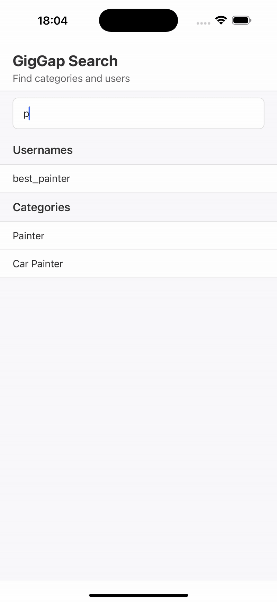

# GigGap SearchBar Coding Challenge

A React Native application that demonstrates a search functionality for categories and users with debounced search and grouped results display.

## Demo Video

## Features

- **Search Bar**: Input field that triggers search after 3+ characters
- **Debounced Search**: 300ms delay to prevent excessive searches
- **Dual Results**: Separate sections for matching usernames and categories
- **Case-insensitive Search**: Works regardless of input case

## Search Examples

- Type "pai" → Shows: `best_painter` (Usernames) and `Painter`, `Car Painter` (Categories)
- Type "car" → Shows: `no_1_car_mechanic` (Usernames) and `Carpenter`, `Car Painter` (Categories)
- Type "carp" → Shows: `Carpenter` (Categories only)

## Technical Details

- **React Native Version**: 0.72.9
- **Search Algorithm**: Case-insensitive substring matching
- **Debouncing**: 300ms delay to prevent excessive searches
- **Minimum Query Length**: 3 characters required to trigger search
- **Results Display**: SectionList with grouped results

## Search Behavior

The search functionality:
1. **Initial State**: Shows all categories and users when the app loads
2. **Search Trigger**: Only starts filtering after user enters 3+ characters
3. **Case-insensitive Search**: Performs search across both users and categories
4. **Grouped Results**: Displays results under "Usernames" and "Categories" sections
5. **Real-time Updates**: Updates with 300ms debouncing to prevent excessive searches
6. **Empty State**: Shows "No results found" when search returns no matches
7. **Return to All**: Shows all data again when search query is cleared or reduced below 3 characters

